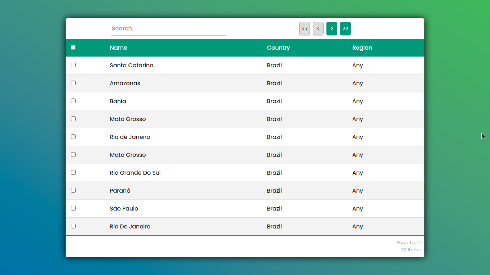

## React Table

A simple project using React Table and typescript, just to have fun!

### A brief overview

#### Table features

1. Pagination
2. Row selection
3. Global filter

### To run this project

1. Download the dependencies running `$ yarn` inside the project folder.
2. Make sure you have JSON SERVER installed globally in your machine.
3. Run the small api which you can find on `database.json` using the command ahead `$ yarn json:server`.
4. Run the React app using `$ yarn start`.
